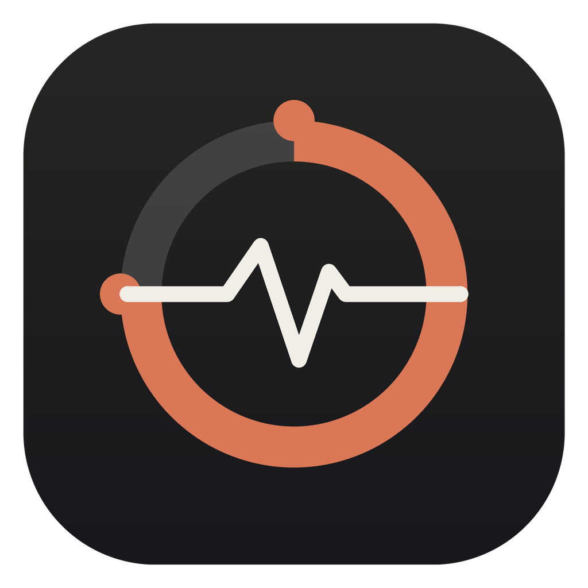
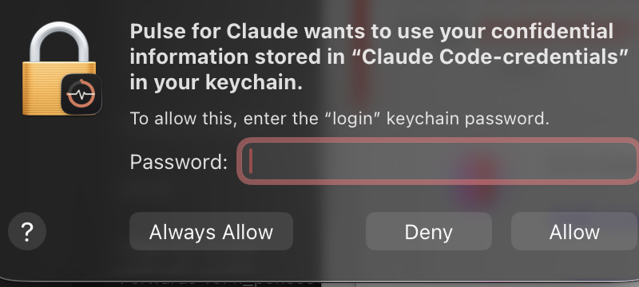

<p align="center">
  
</p>

<h1 align="center">Pulse for Claude</h1>

<p align="center">
  Your Claude usage, live in the Mac menu bar.<br>
  <em>Never get surprised by "limit reached" again.</em>
</p>

---

Claude hides your usage meter behind Settings. **Pulse puts it in your menu bar**, always on, updated every minute. A little ring fills up as you use your plan. Green means relax. Orange means pace yourself. Red means wrap it up.

It shows the exact same numbers the Claude app shows you:

- **5-hour limit** with time until reset
- **Weekly limits** (all models, plus model-specific buckets like Sonnet or Opus)
- **Usage credits** (your extra usage balance, like $0.00 of $80.00)
- **Per-model breakdown** of your last 7 days, computed locally from your own machine
- **API spend** (optional, for developers with an Anthropic Admin API key)

No account. No server. Nothing leaves your Mac. It reads the Claude login you already have and asks Anthropic's own usage endpoint, the same way the Claude app does. Checking your usage does not use up any usage.

## Install the lazy way (recommended)

You do not need to know anything about GitHub or Terminal. If you use Claude Code or the Claude desktop app, just paste this to Claude:

```
Please install Pulse for Claude for me by following the instructions at
https://raw.githubusercontent.com/cosmic-dynasty/pulse-for-claude/main/FOR_CLAUDE.md
```

Claude will download it, install it, walk you through the two Apple popups, and confirm it is running. That's the whole thing.

## Install the one-line way

Open Terminal (press Cmd+Space, type "Terminal", press Return), paste this, press Return:

```bash
curl -fsSL https://raw.githubusercontent.com/cosmic-dynasty/pulse-for-claude/main/install.sh | bash
```

## Install the manual way

1. Download `Pulse-for-Claude.zip` from the [latest release](https://github.com/cosmic-dynasty/pulse-for-claude/releases/latest)
2. Double-click the zip, then drag **Pulse for Claude** into your **Applications** folder
3. **Right-click** the app and choose **Open**, then click **Open** on the warning

The warning appears because this is a free community app, not a $99/year Apple-notarized one. The full source code is in this repo if you want to check what it does.

## The two popups you will see

**Popup 1, the Keychain prompt.** This is the important one. It looks exactly like this:

<p align="center">
  
</p>

It is Pulse reading the Claude login you already have, so it can ask Anthropic for your usage numbers. Your login never leaves your Mac. Type your Mac password and click **Always Allow** (not just Allow, or it asks again every launch).

**Popup 2, the developer warning.** "macOS cannot verify the developer." Standard for any app outside the App Store. Right-click the app and choose **Open**, or the install script clears it for you automatically.

## Requirements

- A Mac on macOS 13 Ventura or newer (Apple Silicon or Intel)
- Claude Code installed and logged in at least once (the [Claude desktop app](https://claude.com/download)'s Code tab counts)
- A Claude plan (Pro or Max)

## What's in the menu

Click the ring to see everything:

```
Pulse for Claude
  5-hour limit            15%  ▓▓░░░░░░░░  resets in 4h 12m
  Weekly · all models     14%  ▓▓░░░░░░░░  resets in 3d 0h
  Weekly · Sonnet only     0%  ░░░░░░░░░░
  Usage credits                $0.00 of $80.00
  ────────────────────────────
  Models · last 7 days (local)
  Opus 4.7    1.2M · today 82K
  Sonnet 4.6  340K · today 0
  ────────────────────────────
  Track API Spend (optional)
  Icon Style        ▸  Ring + percent / Battery bar / Percent only / Liquid orb
  Icon Shows        ▸  5-hour limit / Weekly limit / Highest of all
  Launch at Login
  Refresh Now
```

Pick your icon style, pick which number the icon tracks, set it to launch at login, done. When any limit passes 90 percent, the icon pulses to get your attention.

### Icon styles

- **Ring + percent** the default, a circular meter that fills and changes color
- **Battery bar** a slim horizontal meter, like a battery gauge
- **Percent only** just the colored number, most minimal
- **Liquid orb** a filling orb with a gentle wave on the surface
- **Ring + spark flip** the ring, but every few seconds it flips to a glowing spark and back, the most eye-catching on a screen recording

### Moving it in the menu bar

Pulse tries to place itself as far right as macOS allows third-party icons to sit, just left of Control Center and the clock. To move it: hold **Cmd** and drag the icon anywhere along the menu bar. To snap it back to the far right, open the menu and click **Pin to Far Right**. Note that macOS does not let any third-party app sit to the right of the clock, that zone is reserved for the system, so far-right-but-left-of-the-clock is as far as any app like this can go.

## Privacy, plainly

- Your Claude login token is read from your Mac's Keychain and is only ever sent to `api.anthropic.com` and `console.anthropic.com`, which is exactly where the Claude app sends it
- No analytics, no tracking, no third-party servers, no data collection of any kind
- The optional API spend key is stored in your own Keychain and only sent to `api.anthropic.com`
- Around 1,000 lines of Swift in one file: [`src/main.swift`](src/main.swift). Read it, or paste it into Claude and ask "is this safe?"

## FAQ

**Does checking my usage burn my usage?** No. The usage endpoint is free to call and does not count against any limit.

**The icon shows "!"** Your Claude login needs a refresh. Open Claude Code (or the desktop app's Code tab) once, then click Refresh Now in the menu.

**The icon shows a gray ring** It is loading, give it a second.

**Does it work if I only use claude.ai in the browser?** You need Claude Code installed and logged in once, because that is where the app reads your login from. The desktop app's Code tab does this too.

**Will Anthropic adding new limits break it?** No. Pulse parses the usage feed dynamically, so any new limit buckets Anthropic adds show up in the menu automatically, no update needed.

**I installed it but no icon appeared** Your menu bar is probably full. macOS quietly hides menu bar icons when it runs out of room, especially on MacBooks with a notch. Hold Cmd and drag some icons you don't need off the menu bar (they vanish in a puff), or if you use a menu bar manager like Bartender, Ice, or BetterTouchTool's Notch Bar, unhide Pulse there. Quit and reopen Pulse after making room.

**How do I uninstall it?** Quit it from the menu, then drag the app from Applications to the Trash.

## Build it yourself

```bash
git clone https://github.com/cosmic-dynasty/pulse-for-claude.git
cd pulse-for-claude
./build.sh
open "build/Pulse for Claude.app"
```

Needs Xcode Command Line Tools (macOS will offer to install them automatically).

---

<p align="center">
Built with <a href="https://claude.com">Claude</a> by <strong>Ant the AI Guy</strong> · Everyday AI Club<br>
MIT licensed. Not affiliated with or endorsed by Anthropic.
</p>
